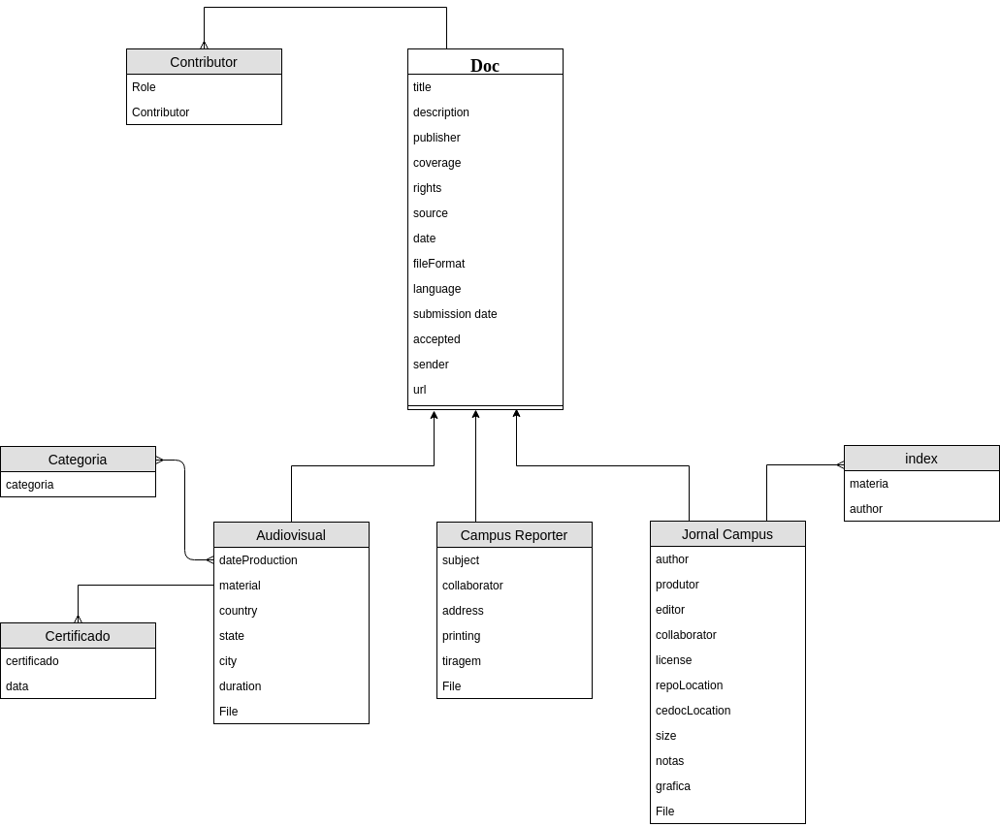

# Manual do Desenvolvedor para o Sistema Fac App


- [Manual do Desenvolvedor para o Sistema Fac App](#manual-do-desenvolvedor-para-o-sistema-fac-app)
- [Overview](#overview)
    - [`cedoc`](#cedoc)
    - [`accounts`](#accounts)
    - [`django-admin`](#django-admin)
- [Ambiente de Produção vs Ambiente de Desenvolvimento](#ambiente-de-produ%C3%A7%C3%A3o-vs-ambiente-de-desenvolvimento)
- [Superusuários](#superusu%C3%A1rios)
    - [Poderes do Superusuário](#poderes-do-superusu%C3%A1rio)
- [Models - Banco de Dados](#models---banco-de-dados)
    - [Esquema das tabelas](#esquema-das-tabelas)
    - [Sincronizando o Banco de Dados](#sincronizando-o-banco-de-dados)

O sistema foi implementado usando a linguagem Python, suportado pelo framework Django. Esse framework é voltado para desenvolvimento web e já vem com inúmeras capacidades. Usamos a versão 2.0 do Django nesta aplicação. A [documentação oficial](https://docs.djangoproject.com/pt-br/2.0/) do Django é muito completa. Ela será sua melhor amiga para este projeto.

Recomendamos ler e entender a estrutura de arquivos do Django antes de prosseguir no entendimento do sistema. Além disso, caso você esteja aqui, estamos considerando que o sistema já esteja instalado na sua máquina (seja ela de produção ou desenvolvimento). Se esse não for o caso, siga primeiro [estas instruções](instructions.md).

# Overview

- A pasta do projeto é `facapp`;
- O sistema contém dois aplicativos, `cedoc` e `accounts`;
- O aplicativo `cedoc` é o responsável pelos arquivos e funcionalidades do sistema;
- O aplicativo `accounts` é o responsável pelo controle dos usuários.
- Além desses deixamos o `django admin`, para ter um fallback capaz de administrar o banco de dados, caso algum dos outros sistemas apresente problema.
- A pasta `media` é a pasta para salvar os arquivos de mídia enviados ao sistema.

## `cedoc`

A pasta `cedoc` é, de certa forma, onde mora a parte "funcional" do projeto. É nele que estão as definições dos modelos do banco de dados, das views e templates de renderização, entre outras coisas. Os arquivos de maior importância são:

- `models.py`
    - Armazenam as definições de todos os modelos dos arquivos que estão no banco de dados.
- `views.py`
    - Definem as funções a serem executadas para cada request recebido pelo server, e qual a resposta.
- `forms.py`
    - Define os formulários de envio para todos os modelos em `models.py`.
- `validators.py`
    - Define quais são as extensões de arquivo permitidas para os diferentes tipos de arquivo.

## `accounts`

A pasta `accounts` é onde se encontra tudo relacionado as contas criadas e utilizadas no projeto. O Django já possui um ótimo sistema de cadastramento e autenticação de usuários, dito isso, utilizamos muitas de suas funcionalidades que já estavam implementadas, neste projeto.

- `django.contrib.auth`
    - É o sistema de autenticação usado para realização do login, logout e cadastramento de usuários do próprio Django.
- `forms.py`
    - Define o formulário para o cadastramento de usuários.
- `views.py`
    - Definem a função de cadastramento a partir do formulário e a valida.

## `django-admin`

O `django-admin` é uma funcionalidade inclusa próprio Django que possui diversas funcionalidades de administrador além de uma interface amigável para o mesmo. Ele pode ser acessada colocando `/admin` no endereço da página.

- `Autenticação e Autorização`
    - `Grupos`: Nesta sessão podem ser criados grupos de usuário, onde cada grupo pode ter diferentes permissões;
    - `Usuários`: Nesta sessão é possível visualizar e editar cada usuário, seus dados cadastrados (não possível visualizar senhas) e apaga-lo se desejado.
- `CEDOC`
    - É onde estão armazenados todos os dados sobre os arquivos inseridos no site. 

# Ambiente de Produção vs Ambiente de Desenvolvimento

Atualmente o sistema está organizado para ambiente de desenvolvimento. Para colocá-lo em ambiente de produção alguns passos precisam ser tomados.

1. Modificar em `settings.py` a variável DEBUG para False.
2. Criar um banco de dados no servidor, e configurar o Django para conectar-se à este banco de dados. [Instruções aqui](django-postgresql.md).
3. Configurar o wsgi, em `wsgi.py`, para funcionar com o Web Server escolhido. Recomendamos ler a [documentação](https://docs.djangoproject.com/en/2.0/howto/deployment/wsgi/), aqui você encontrará as explicações e passo a passo necessários.

# Superusuários

A aplicação `accounts` é responsável por cadastrar e fornecer suporte para os usuários externos ao Cedoc. Todos esses são usuários comuns do sistema. Um superusuário é criado de maneira diferente. Recomendamos que só exista 1 superusuário, cadastrado da seguinte maneira:

```bash
$ cd facapp
$ python manage.py createsuperuser
```

Você terá que preencher os dados do usuário - nome, e-mail e senha. Sugerimos `Cedoc` como o nome. O e-mail deve ser `cedoc@fac.unb.br`. A senha deve ser uma sena forte, pois este usuário tem muito controle sobre o sistema.

## Poderes do Superusuário

O superusuário é o único usuário capaz de acessar o Django Admin (`<base_url>/admin`). Do Django Admin ele terá uma visão de todos os modelos cadastrados na aplicação Django Admin. Esses incluem os modelos do app `cedoc`, mas principalmente os usuários do sistema. Ou seja, **apenas o superuser pode deletar usuários**.

Além disso apenas o superusuário pode validar os documentos enviados para o Cedoc através do sistema, e criar/deletar categorias.

# Models - Banco de Dados

Usamos um banco de dados relacional para modelar nossas entidades. As definições das tabelas estão em `models.py`. Ao se conectar com o banco de dados e fazer as migrações as tabelas correspondentes serão criadas. Note que existem dois arquivos `models.py` diferentes, um pertencente ao app `cedoc` e outro do app `accounts`. Apesar de estarem todas no mesmo banco de dados, as tabelas não são relacionadas, e por isso estão assim.

## Esquema das tabelas

Vamos dar mais detalhes às tabelas relacionadas ao app `cedoc`. Elas seguem o modelo relacional da figura abaixo.

O modelo é relativamente simples, tempo uma entidade `Doc` principal, que é especializada pelas entidades `Audiovisual`, `Campus Repórter` e `Jornal Campus`. As entidades além dessas são as que possuem alguma relação com os modelos. 



## Sincronizando o Banco de Dados

Existem dois comandos importantes no Django para mexer com o banco de dados. Para mais informações procure a documentação oficial.

1. Fazer migrações para o banco de dados: `python manage.py makemigrations`
    - Necessário quando os `models` são modificados para indicar ao banco que mudanças são necessárias. Esse comando gera os arquivos `.sql` que fazem as alterações no banco.

2. Conectar as migrações com o banco: `python manage.py migrate` 
    - Esse comando executa os arquivos de migração no banco, sincronizando-o com os modelos definidos. Não se esqueça de executar esse comando após cada alteração nos modelos.