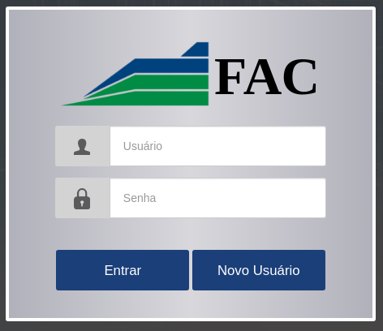
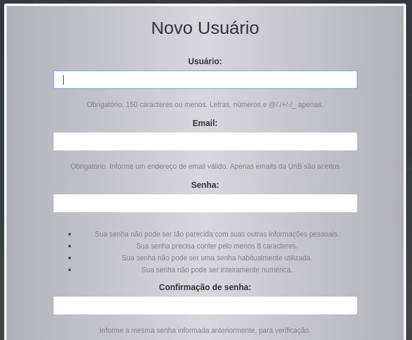
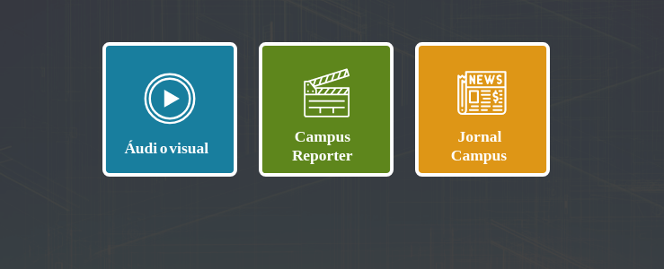

# Manual do Usuário para o Sistema FacApp

O sistema foi feito para ser bastante intuitivo, então você não deve ter problemas com ele. 
O sistema foi desenvolvido inicialmente para a disciplina Desenvolvimento de Aplicações - CiC, pelos alunos Vitor F Dullens, Felipe Magalhães e Giovanni M Guidini, em 2018/1.

- [Manual do Usuário para o Sistema FacApp](#manual-do-usu%C3%A1rio-para-o-sistema-facapp)
    - [Funcionalidades do Sistema](#funcionalidades-do-sistema)
        - [Para usuários comuns (professores e alunos da FAC)](#para-usu%C3%A1rios-comuns-professores-e-alunos-da-fac)
        - [Para usuários do Cedoc](#para-usu%C3%A1rios-do-cedoc)
        - [Dos Tipos de Arquivos Aceitos](#dos-tipos-de-arquivos-aceitos)
    - [Interfaces do Sistema](#interfaces-do-sistema)
        - [Menu de Login](#menu-de-login)
        - [Cadastro de Novo Usuário](#cadastro-de-novo-usu%C3%A1rio)
        - [Menu Principal](#menu-principal)
        - [Opções de Documentos](#op%C3%A7%C3%B5es-de-documentos)
    - [Do Envio de Arquivos](#do-envio-de-arquivos)
    - [Da Edição de Documentos](#da-edi%C3%A7%C3%A3o-de-documentos)

## Funcionalidades do Sistema
### Para usuários comuns (professores e alunos da FAC)
- Envio de arquivos do Jormal Campus para o Cedoc;
- Envio de arquivos da Revista Campus Repórter para o Cedoc;
- Envio de arquivos audiovisuais para o Cedoc;
- Possibilidade de edição dos arquivos enviados;
- Visualização dos arquivos aprovados;
- Visualização das categorias para arquivos audiovisuais.

### Para usuários do Cedoc
- Todas as funcionalidades acima;
- Criar e deletar categorias do audiovisual;
- Validar documentos enviados.

### Dos Tipos de Arquivos Aceitos
Os arquivos aceitos até agora são arquivos `.pdf` para Jornal Campus e Revista Compus Repórter. Para a modalidade audiovisual os arquivos aceitos são `.mp3` e `.mp4`. Se você precisa enviar um tipo de arquivo que não está entre esses deve pedir ao Cedoc para disponibilizar esta nova extensão.

## Interfaces do Sistema
### Menu de Login

A primeira página do sistema para usuários não cadastrados é a página de login. Ela é como mostrada abaixo. 

Caso você ainda não um usuário cadastrado, cadastre o novo usuário. Se você tiver um usuário cadastrado basta entrar com suas credenciais.

### Cadastro de Novo Usuário

As informações necessárias para cadastrar um novo usuário são: Nome de Usuário, E-mail, e uma Senha.
O e-mail utilizado **precisa** ser um e-mail da UnB válido.

### Menu Principal

Aqui no menu principal os usuários externos ao Cedoc tem a visão dos documentos que foram enviados por eles, separados entre os documentos validados pelo pessoal do Cedoc e os não validados. OS documentos ainda não validados estão disponíveis para serem editados. Os funcionários do Cedoc podem ver *todos* os arquivos enviados (não apenas os enviados por eles). Além disso podem deletar os arquivos já validados depois que eles foram movidos para o repositório apropriado.

No menu acima, a opção `Adicionar Documento` abre as opções para escolher o tipo de documento a ser enviado. A opção `Categorias Audiovisual` mostra as categorias disponíveis para os arquivos audiovisuais. Usuários externos ao Cedoc podem apenas visualizar as categorias. Caso precisem de alguma que não esteja disponível devem pedir ao Cedoc para adicioná-la. Os usuários do Cedoc, obviamente, podem adicionar e deletar categorias.

### Opções de Documentos

Conformeespecificado acima, as opções disponíveis são: Audiovisual, Jormal Campus e Campus Repórter. Selecionando cadaa opção o usuário é redirecionado para o formulário de envio de cada tipo de arquivo. Veja detalhes abaixo.

## Do Envio de Arquivos

Todos os tipos se arquivos possuem campos comuns a serem preenchidos. Além desses campos gerais cada tipo tem seus campos particulares. Os dados são necessários para o pessoal do Cedoc poder colocar esses arquivos no repositório correto futuramente. 

Ao começar a preencher os campos você verá que vários deles estão preenchidos com valores iniciais. Não mude esses valores se não souber o que colocar naquele campo, ou se aquele valor for o valor correto.

Tratemos então dos campos que merecem algum destaque:
- O campo `Data do Documento` é a data do Documento em si, e não a data em que ele foi enviado.
- Nos botões `Arquivo Digital`, `Url` e `Arquivo Físico` escolha apenas 1 opção de acordo com a sua necessidade: 
    - Arquivo Digital é para enviar uma cópia digital do arquivo;
    - Url é para enviar um link para o material, se estiver disponível na internet;
    - Arquivo Físico é para sinalizar que uma cópia física do material foi enviada para o Cedoc.
- No campo `Duração` para arquivos audiovisuais, utilize o formato `hh:mm:ss`.

Os formulários tem pelo menos 2 partes. Os arquivos audiovisuais e Jornal Campus tem formulários de 3 partes. As partes subsequentes são informações adicionais que envolvem:

- Para todos os arquivos: Os contribuidores do trabalho e seu papel;
- Para os arquivos audiovisuais: Os certificados recebidos pelo trabalho;
- Para Jornal Campus: O índice do jornal, isto é, título de cada matéria e o nome do autor.

Ao final do preenchimento dos dados uma nova entrada aparecerá na página principal, relativa ao novo documento adicionado.

## Da Edição de Documentos

Para editar um documento basta clicar na opção `Editar` na linha do documento a ser editado. Nesta edição é possível modificar qualquer campo do documento.

Além disso, se foi enviado um arquivo digital junto com aquele documento é possível visualizar o arquivo enviado, e baixá-lo, se for o caso.

Ao final da edição você terá a opção `Salvar`, para salvar as mudanças, ou `Deletar` para deletar o documento. Usuários do Cedoc também possuem a opção `Salvar & Validar`, para validar o documento.